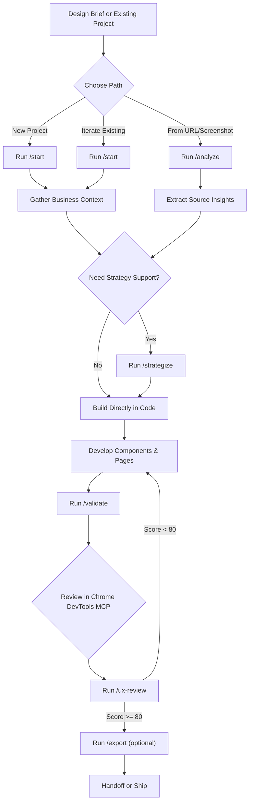

# Wireframe Platform

**Ship high-fidelity wireframes faster.** Build complete multi-page wireframe experiences with strategic variants, real business context, and production-ready React code—in minutes instead of days.

**Perfect for:**

- Product teams testing layout hypotheses
- Designers validating UX concepts
- Agencies pitching clients with interactive prototypes
- Developers scaffolding new features

Replace static mockups with living, testable wireframes. Each variant links to business goals and user personas, making every design choice measurable.

## 🚀 Quick Start

**Get started in 3 steps:**

```bash
# 1. Clone and install
git clone <your-repo-url> wireframe-platform
cd wireframe-platform
npm install
# → Automatically validates setup and creates config

# 2. Create your first wireframe project
npm run init
# → Interactive wizard walks you through setup

# 3. Start developing
npm run dev
# → Opens http://localhost:8080
```

**That's it!** Your wireframe platform is ready.

### What Just Happened?

1. `npm install` ran automatic setup validation
2. `npm run init` created a project workspace with your chosen template:
   - **Blank** - Minimal starting point
   - **Showcase** - See all available components
   - **Example** - Full project with variants and business context
3. `npm run dev` starts the dev server and shows your wireframe dashboard

### Next Steps

After your first wireframe is running:

- Edit components in `projects/YOUR-PROJECT/src/wireframes/YOUR-PROJECT/`
- Add variants to test different layouts
- Run `npm run validate:metadata` to check your work
- Use Chrome DevTools MCP for visual validation (pre-configured in `.mcp.json`)
- Deploy to Replit, Vercel, or any Node.js host

**New to the platform?** Check out the [Quick Start Guide](./packages/wireframe-core/docs/guides/QUICK-START.md) for a detailed walkthrough.

### Troubleshooting

**Setup validation fails?**

- Ensure you're using Node.js v18 or higher: `node --version`
- Delete `node_modules` and `package-lock.json`, then run `npm install` again

**`npm run init` doesn't work?**

- Make sure you've run `npm install` first
- Check that `packages/wireframe-core/scripts/init.mjs` exists

**No wireframes showing up?**

- Verify `metadata.json` exists in your wireframe directory
- Run `npm run validate:metadata` to check for errors
- Check the browser console for route conflicts

**Need help?** Open an issue or check [CLAUDE.md](./CLAUDE.md) for complete development guidance.

### Developer Tools

Utility commands for diagnostics and maintenance:

```bash
# Get project overview
npm run list              # Shows all wireframes and variant counts

# Health check
npm run doctor            # Validates Node, deps, metadata, routes, Git status

# Create new project
npm run create            # Alias for npm run init (simpler)

# Validate everything
npm run validate:all      # Runs all validations (metadata, routes, business context, TypeScript)

# Nuclear cleanup (with confirmation)
npm run clean:all         # Cleans temp files, build artifacts, MCP caches
```

**Pro tips:**

- Run `npm run doctor` before starting work to check framework health
- Run `npm run validate:all` before committing changes
- Use `npm run list` to see all projects at a glance

## 📚 Documentation

### Quick Start

- **[AGENTS.md](./AGENTS.md)** — Operational quick-start for agents and humans (auto-generated highlights)
- **[Quick Start Guide](./packages/wireframe-core/docs/guides/QUICK-START.md)** — 5-minute setup walkthrough

### Development Guides

- **[CLAUDE.md](./CLAUDE.md)** — Canonical development playbook (architecture, workflows, standards)
- **[AGENT-WORKFLOWS.md](./AGENT-WORKFLOWS.md)** — Agent orchestration and workflow definitions
- **[Workflows Guide](./packages/wireframe-core/docs/guides/WORKFLOWS.md)** — Common development patterns

### Framework Documentation

- **[API Reference](./packages/wireframe-core/docs/API.md)** — Complete framework API documentation
- **[Migration Guide](./packages/wireframe-core/docs/MIGRATION-GUIDE.md)** — Migrate existing projects to framework
- **[Changelog](./packages/wireframe-core/CHANGELOG.md)** — Framework version history
- **[Metadata Schema](./packages/wireframe-core/docs/METADATA-SCHEMA.md)** — Schema v2.0 specification
- **[Routing System](./packages/wireframe-core/docs/ROUTING.md)** — Dynamic routing guide
- **[Snapshot System](./packages/wireframe-core/docs/SNAPSHOT-SYSTEM.md)** — Version control for git-ignored files
- **[Maintenance](./packages/wireframe-core/docs/MAINTENANCE.md)** — Temp file cleanup procedures

### Other Resources

- **[DOCUMENTATION.md](./DOCUMENTATION.md)** — Full documentation index
- **[Design Fundamentals](./context/WIREFRAME-FUNDAMENTALS.md)** — Design system principles

### Docs Maintenance

- Auto-generate AGENTS.md highlights: `npm run docs:build`
- Verify AGENTS.md is in sync: `npm run docs:check`
- CI enforces docs sync on PRs via `.github/workflows/docs.yml`

## 🤖 AI-Assisted Workflow (Recommended)

Use slash commands in Claude Code or Codex CLI to let AI agents handle the heavy lifting. They orchestrate the right agents and CLI scripts behind the scenes, so you can stay in the chat-driven flow:



### Slash Commands

| Command | Purpose | When to Use |
|---------|---------|-------------|
| `/wf` | Run full workflow end-to-end | Starting a new project from scratch |
| `/analyze` | Analyze brief → structured requirements | Have a brief but need strategic analysis |
| `/strategize` | Generate differentiated variants | Need variant hypotheses and layouts |
| `/validate` | Check metadata & business alignment | Before implementing or after changes |
| `/export` | Package artifacts (optional: Lovable) | Ready to hand off or export |
| `/ux-review` | Grade built variants and log UX feedback | After capturing DOM/screenshot for a variant |
| `/start` | Show current workflow state | Resume work or check progress |

**Setup:** Run `npm run wf:setup -w @wireframe/core` to sync slash commands with Claude Code.

**Example:**

```
/wf --project my-landing-page --brief projects/<workspace>/src/wireframes/my-landing-page/brief.txt
```

The workflow orchestrates agents automatically, validates alignment with business goals, and prepares everything for implementation.

## 🛠️ Framework Commands

### Project Development

```bash
# Development server
npm run dev -w projects/<project-name>

# Build for production
npm run build -w projects/<project-name>

# Validate metadata
npm run validate:metadata -w projects/<project-name>

# Lint project
npm run lint -w projects/<project-name>
```

### Framework Development

```bash
# Build framework
npm run build -w @wireframe/core

# Lint framework
npm run lint -w @wireframe/core

# Type check framework
npm run typecheck -w @wireframe/core
```

### Workflow Tools

<details>
<summary><strong>Click to expand CLI reference</strong></summary>

| Task | Command | Notes |
| --- | --- | --- |
| Scaffold new project | `npm run scaffold -w @wireframe/core -- --project <slug> [--apply-routes=root\|namespace]` | Creates a workspace project with starter metadata/pages wired to the framework |
| Transcribe page → wireframe | `npm run transcribe -w @wireframe/core -- --project <slug> --url=<url>`<br>`npm run transcribe -w @wireframe/core -- --project <slug> --screenshot=<path>` | Generates structured section maps + metadata drafts from live pages or screenshots |
| Iterate existing wireframe | `npm run iterate -w @wireframe/core -- --project <slug> --from=baseline --new=variant [--apply-routes=root]` | Clones an existing variant to jump-start a new exploration while preserving routing |
| Run agent workflow | `npm run orchestrate -w projects/<project> -- --project <slug> [--prepare-prompts --force-business-context --skip-variant ...]` | Drives the end-to-end agent sequence; workspace scripts prefill a default slug, but an explicit `--project` keeps the command portable |
| Self-iteration loop | `npm run self-iterate -w projects/<project> -- --project <slug> [--headless --isolated --auto-fix --grade-threshold <n> --non-interactive]` | Captures Chrome DevTools MCP artifacts and runs UX review + validation; prompts for config in interactive mode |
| Run UX review | `npm run ux:review -w projects/<project> -- --variant <key> [--dom <path>] [--screenshot <path>] [--change-log <path>]` | Generates a ready-to-run `ux-review` prompt and logs JSON/Markdown outputs alongside the shared change log |
| Optional Chrome bridge | `node packages/wireframe-core/scripts/mcp/devtools-http-bridge.mjs` | Launches the Puppeteer-powered MCP HTTP bridge manually (self-iteration auto-starts when needed) |
| Export business context JSON | `npm run export:business-context -w @wireframe/core` | Reads Markdown context and refreshes `context/temp-agent-outputs/business-context.json` |
| Validate metadata schema | `npm run validate:metadata -w projects/<project>` | Fails fast when `metadata.json` drifts from schema v2.0 |
| Migrate legacy metadata | `npm run migrate:metadata -w @wireframe/core -- --project <slug>` | Converts v1 metadata and writes a `.v1.backup` for safety |
| Clean temp artifacts | `node packages/wireframe-core/scripts/clean-context-temp.mjs [--dry-run] [--include-agent-outputs] [--include-chrome-mcp-cache] [--include-mcp-log-cache]` | Empties `context/temp/` and optional MCP caches; combine flags as needed |
| Smoke-test exporter | `npm run test:export-business-context -w @wireframe/core` | Ensures business-context export pipeline stays healthy |

</details>

## 📦 Framework Package (@wireframe/core)

The `@wireframe/core` package provides:

### Components

- **WireframeHeader** — Sticky navigation with mobile menu
- **ErrorBoundary** — React error boundary
- **ProgressIndicator** — Progress bar component (v2.0.1+)
- **50+ UI Primitives** — shadcn-ui components (Button, Card, Input, etc.)
- **Pattern Components** — MetricCard, FeatureGrid, TestimonialCard, etc.

### Utilities

- **Routing** — `generateAllWireframeRoutes()`, `generateRoutesFromMetadata()`, etc.
- **Metadata** — `validateMetadata()`, `deriveVariantRoutes()`, `getFullRoutes()`, etc.
- **Helpers** — `cn()` class merger, design tokens, etc.

### Hooks

- **useToast** — Toast notification system
- **useIsMobile** — Mobile viewport detection

### Configuration

- **Vite** — `createWireframeViteConfig()` for project vite.config.ts
- **Tailwind** — `createWireframeTailwindConfig()` for project tailwind.config.ts
- **TypeScript** — Base tsconfig.base.json to extend

### Scripts

- Metadata validation, scaffolding, orchestration, cleanup tools

**Full API Reference**: [packages/wireframe-core/docs/API.md](./packages/wireframe-core/docs/API.md)

## 🎯 Design Principles

- **Grayscale-first** — Neutral palette, minimal color
- **8px rhythm** — Consistent spacing system
- **12-column grid** — Max width 1280px
- **WCAG 2.1 AA** — Accessibility built-in
- **Mobile-responsive** — All breakpoints tested

See [WIREFRAME-FUNDAMENTALS.md](./context/WIREFRAME-FUNDAMENTALS.md) for complete guidelines.

## 🤖 Core Agents (Behind the Scenes)

The slash commands orchestrate these specialized agents:

- **business-context-gatherer** — Captures strategic goals, personas, KPIs
- **brief-analyzer** — Extracts requirements, sections, routing needs
- **wireframe-strategist** — Designs 2-3 differentiated variants
- **visual-ux-advisor** — Recommends layouts and interactions (optional)
- **variant-differentiator** — Defines hypotheses for each variant (optional)
- **business-context-validator** — Ensures alignment with business goals
- **wireframe-validator** — Grades wireframes against requirements (self-iteration)
- **ux-review** — Critiques built variants, logs UX findings, and gates pass/fail at 80%+

**Deep dive**: See [AGENT-WORKFLOWS.md](./AGENT-WORKFLOWS.md) and [templates/agents/](./packages/wireframe-core/templates/agents/) for complete definitions.

## 🧠 Business Context Lifecycle

**Why it matters**: Business context transforms wireframes from arbitrary design variations into strategic experiments. Without it, you're building layout options. With it, each variant becomes a targeted hypothesis testing which personas, goals, and messaging resonate best—with traceability from business objectives through metadata to implementation.

**How it works**: The platform uses `context/BUSINESS-CONTEXT.md` as the strategic foundation for all wireframe decisions. Agents reference this context to ensure each variant aligns with real business objectives. Each project's `metadata.json` links variants to specific `goalIds` and `personaIds`, making every design decision measurable and strategically defensible.

### Workflow

- **Initial setup**: First run of `business-context-gatherer` scaffolds `context/BUSINESS-CONTEXT.md` (git-ignored, persistent)
- **Updates & revisions**: Rerun gatherer with `--force-business-context` to append new intelligence
- **Export to structured JSON**: Run `npm run export:business-context` to regenerate machine-readable format
- **Link to metadata**: Copy goal/persona IDs into `metadata.json` (`businessContext` and `businessContextRef`)

**Result**: Every wireframe variant has documented business rationale with full traceability.

## 🗂️ Temp Artifacts & Cleanup

- Ephemeral assets now live under `context/temp/`:
  - `context/temp/screenshots/` — one-off captures (Chrome DevTools MCP, reviews, etc.)
  - `context/temp/projects/<slug>/` — project-specific snapshots (e.g., HTML dumps, JSON exports)
- Agent pipelines continue to write to `context/temp-agent-outputs/`; leave the structure in place so orchestrator runs can resume, but feel free to clear it between sessions.
- UX review transcripts live under `context/temp-agent-outputs/ux-review/<project>/` (JSON + Markdown per variant) and change logs live under `context/temp-agent-outputs/<project>/ux-review/`; keep them between iterations so agents can reference prior feedback.
- Use `node packages/wireframe-core/scripts/clean-context-temp.mjs --dry-run` to preview cleanup, then rerun without the flag to delete. Add `--include-agent-outputs` when you also want to wipe the orchestrator artifacts.
- Add `--include-chrome-mcp-cache` to remove the Chrome DevTools MCP browser profile (~70 MB+ under `~/.cache/chrome-devtools-mcp`). Add `--include-mcp-log-cache` to purge Claude MCP logs (`~/Library/Caches/claude-cli-nodejs/**/mcp-logs-chrome-devtools`).
- Shortcut aliases still exist in legacy projects (`npm run clean:chrome-cache`, `npm run clean:mcp-logs`, `npm run clean:all-mcp`); recreate them per project if helpful.
- Anything worth keeping long-term should move into `context/archive/` (tracked) or the relevant project directory inside `src/wireframes/`.

## 🧪 Testing & Validation

### Browser Review

- Preview with `npm run dev -w projects/<project-name>`
- Validate layout, interactions, and content before sign-off

### Self-Iteration (Chrome DevTools MCP)

```bash
npm run self-iterate -w projects/<project> -- --project <slug> --headless --isolated
```

Automates validation and captures evidence:

1. Auto-launches Chrome DevTools MCP bridge
2. Navigates routes, collects DOM snapshots, takes screenshots
3. Runs UX Review agent (grades goal alignment, accessibility, visual hierarchy, change coverage)
4. Runs Wireframe Validator against captures
5. If grade >= threshold AND validation passes → Done
6. If `--auto-fix` → Applies fixes, iterates again
7. Writes artifacts to `context/temp-agent-outputs/self-iteration/<slug>/`

**Configuration flags:**

| Flag | Purpose |
|------|---------|  
| `--grade-threshold <n>` | Override passing grade (0-100, default: 80) |
| `--auto-fix` | Enable automatic fix attempts |
| `--non-interactive` | Skip prompts (for CI/scripted use) |
| `--max-iterations <n>` | Override max iterations (1-10, default: 2) |

**Interactive mode:** When running in a terminal without `--non-interactive`, the script prompts for auto-fix and grade threshold preferences before starting.

**Troubleshooting**: [packages/wireframe-core/docs/TROUBLESHOOTING-CHROME-BRIDGE.md](./packages/wireframe-core/docs/TROUBLESHOOTING-CHROME-BRIDGE.md)

### Legacy E2E Tests

Located in `tests/archive/` for reference only (no longer maintained).

## 📦 Tech Stack

- **Framework** — Vite + React 18 + TypeScript
- **Styling** — Tailwind CSS 3
- **Components** — shadcn-ui (Radix UI)
- **Routing** — React Router v6 (metadata-driven)
- **Forms** — React Hook Form + Zod
- **Icons** — Lucide React, @iconify/react
- **Testing** — Chrome DevTools MCP
- **Monorepo** — npm workspaces

## 🏗️ Architecture

This repository uses a **monorepo structure** with a reusable framework package and isolated project workspaces:

```
wireframe-platform/                  # Root monorepo
├── packages/
│   └── wireframe-core/              # @wireframe/core v2.0.1
│       ├── src/                     # Framework components, utilities, routing
│       ├── scripts/                 # CLI tools (init, validate, orchestrate)
│       ├── configs/                 # Base configs (Vite, Tailwind, TypeScript)
│       ├── templates/               # Project templates (blank, showcase, example)
│       ├── schemas/                 # JSON schemas
│       └── docs/                    # Framework documentation
│
└── projects/
    └── YOUR-PROJECT/                # Created by `npm run init`
        ├── src/wireframes/          # Your wireframe projects
        │   └── YOUR-WIREFRAME/
        │       ├── components/
        │       ├── pages/
        │       ├── metadata.json
        │       └── brief.txt
        ├── vite.config.ts           # Extends framework base
        ├── tailwind.config.ts       # Extends framework base
        └── tsconfig.json            # Extends framework base
```

**Benefits:**

- ✅ Framework evolves independently from your projects
- ✅ Shared components available to all wireframes
- ✅ Update framework via `npm update @wireframe/core`
- ✅ Create new projects in < 5 minutes with `npm run init`
- ✅ Zero code duplication

## 🌟 Key Features

✅ **Monorepo architecture** with reusable framework package
✅ **Framework independence** — update framework without touching projects
✅ **Multi-project support** with isolated workspaces
✅ **Shared component library** for rapid prototyping
✅ **Dynamic routing** auto-generated from metadata
✅ **Agent workflows** for brief-to-prompt generation
✅ **Chrome DevTools MCP** integration for visual validation
✅ **Theme variants** (dark, print, annotated)
✅ **Accessibility-first** design system
✅ **Comprehensive documentation** (API, Migration Guide, Workflows)

## 🚢 Contributing

### Workflow

1. Create feature branch: `git checkout -b feature/my-feature`
2. Make changes and test: `npm run dev -w projects/<project-name>`
3. Build validation: `npm run build -w projects/<project-name>`
4. Commit with conventional format: `feat:`, `fix:`, `chore:`
5. Create pull request with screenshots

### Import Conventions

**Projects should import from framework**:

```tsx
// Framework components and utilities
import {
  WireframeHeader,
  Button,
  Card,
  generateAllWireframeRoutes,
  useToast,
  cn
} from "@wireframe/core";

// Project-specific code (use relative paths)
import { HeroSection } from "../components/HeroSection";
import metadata from "./metadata.json";
```

**Framework code uses relative imports**:

```tsx
// Inside packages/wireframe-core/src/
import { cn } from "../lib/utils";
import { Button } from "../ui/button";
```

See [API Reference](./packages/wireframe-core/docs/API.md) for all available exports.

## 🔗 Quick Links

### Getting Started

- [Quick Start Guide](./packages/wireframe-core/docs/guides/QUICK-START.md)
- [AGENTS.md](./AGENTS.md) — Quick reference

### Development

- [CLAUDE.md](./CLAUDE.md) — Full development playbook
- [API Reference](./packages/wireframe-core/docs/API.md) — Framework API
- [Workflows Guide](./packages/wireframe-core/docs/guides/WORKFLOWS.md) — Common patterns

### Design & Strategy

- [Design Fundamentals](./context/WIREFRAME-FUNDAMENTALS.md) — Design system
- [Agent Workflows](./AGENT-WORKFLOWS.md) — Automation system
- [Metadata Schema](./packages/wireframe-core/docs/METADATA-SCHEMA.md) — Schema v2.0

### Maintenance

- [Changelog](./packages/wireframe-core/CHANGELOG.md) — Version history
- [Maintenance Playbook](./packages/wireframe-core/docs/MAINTENANCE.md) — Operations & guardrails
- [Documentation Index](./DOCUMENTATION.md) — All docs

---

## 🎉 Recent Updates

**v2.0.1** (2025-10-20):

- Added ProgressIndicator component
- Validated framework update workflow (zero project code changes needed)

**v2.0.0** (2025-10-20):

- Extracted framework to @wireframe/core package
- Migrated to monorepo structure
- Created comprehensive documentation (API, Migration Guide, Changelog)
- Condensed CLAUDE.md (41% smaller) and AGENT-WORKFLOWS.md (71% smaller)
- Extracted 11 agent prompts to dedicated template files

See [CHANGELOG.md](./packages/wireframe-core/CHANGELOG.md) for complete version history.

---

**Need help?** Start with [AGENTS.md](./AGENTS.md) for quick reference, then dive into [CLAUDE.md](./CLAUDE.md) or [API Reference](./packages/wireframe-core/docs/API.md) for comprehensive guidance.
